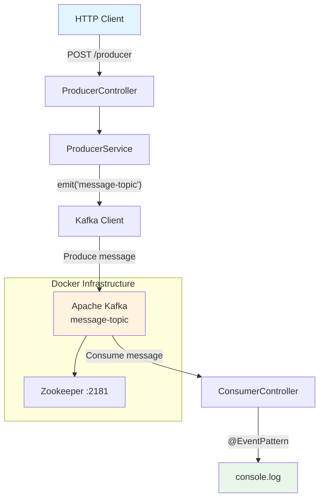

<p align="center">
  
  
</p>

<h1 align="center">NestJS with Kafka</h1>

<p align="center">
  <strong>NestJS</strong> application integrated with <strong>Apache Kafka</strong> for asynchronous messaging.
</p>

<p align="center">
  <a href="#-overview">Overview</a>&nbsp;&nbsp;|&nbsp;
  <a href="#-architecture">Architecture</a>&nbsp;&nbsp;|&nbsp;
  <a href="#-prerequisites">Prerequisites</a>&nbsp;&nbsp;|&nbsp;
  <a href="#-installation">Installation</a>&nbsp;&nbsp;|&nbsp;
  <a href="#-running-the-app">Running</a>&nbsp;&nbsp;|&nbsp;
  <a href="#-api">API</a>&nbsp;&nbsp;|&nbsp;
  <a href="#-testing">Testing</a>&nbsp;&nbsp;|&nbsp;
  <a href="#-screenshots">Screenshots</a>
</p>

---

## 📋 Overview

This project demonstrates the integration of [NestJS](https://nestjs.com/) with [Apache Kafka](https://kafka.apache.org/) using the **asynchronous messaging** pattern. The application exposes a **REST API** that produces messages to a Kafka topic, while a **consumer** listens and processes those messages in real time.

### Data Flow

```
HTTP Client → POST /producer → NestJS Producer → Kafka Topic → NestJS Consumer → Console
```

---

## 🏗️ Architecture

### Directory Structure

```
.
├── docker-compose.yml          # Kafka + Zookeeper infrastructure
├── src/
│   ├── main.ts                 # Entry point + Kafka configuration
│   ├── app.module.ts           # Root application module
│   ├── kafka/
│   │   └── kafka.module.ts     # Shared Kafka client module
│   ├── producer/
│   │   ├── producer.controller.ts   # POST /producer
│   │   ├── producer.service.ts      # Kafka send logic
│   │   ├── producer.module.ts       # Producer module
│   │   └── dto/
│   │       └── create-message.dto.ts # Payload validation
│   └── consumer/
│       ├── consumer.controller.ts   # Kafka event listener
│       └── consumer.module.ts       # Consumer module
├── test/
│   ├── app.e2e-spec.ts         # End-to-end test
│   └── jest-e2e.json           # Jest E2E configuration
└── .env                        # Environment variables
```

### Architecture Diagram



### Components

| Component | Technology | Responsibility |
|---|---|---|
| **REST API** | NestJS + Express | `POST /producer` endpoint with validation |
| **Kafka Client** | `@nestjs/microservices` + KafkaJS | Broker connection and communication |
| **Producer** | KafkaJS Producer | Publishes messages to `message-topic` |
| **Consumer** | KafkaJS Consumer | Listens to the topic and processes events |
| **Broker** | Confluent Kafka 7.4.0 | Distributed messaging |
| **Zookeeper** | Confluent Zookeeper 7.4.0 | Kafka cluster coordination |

### Technical Configuration

- **Broker**: `127.0.0.1:9092`
- **Consumer Group ID**: `main-app-consumer`
- **Topic**: `message-topic`
- **Connection timeout**: 10 seconds
- **Partitioner**: `LegacyPartitioner` (KafkaJS)
- **Validation**: Global `ValidationPipe` with `whitelist` and `forbidNonWhitelisted`
- **HTTP Port**: `4000` (configurable via `PORT` in `.env`)

---

## ✅ Prerequisites

- **Node.js** >= 22
- **npm** >= 10
- **Docker** and **Docker Compose** (to run Kafka)

---

## 🔧 Installation

### 1. Clone the repository

```bash
git clone https://github.com/your-username/nestjs-kafka.git
cd nestjs-kafka
```

### 2. Install dependencies

```bash
npm install
```

### 3. Set up environment variables

```bash
# .env (already present in the project)
PORT=4000
```

### 4. Start Kafka and Zookeeper

```bash
docker-compose up -d
```

> Wait a few seconds for Kafka to be ready to accept connections.

---

## 🚀 Running the App

### Development

```bash
npm run dev
```

The application will be available at **http://localhost:4000**.

### Production

```bash
npm run build
npm run start:prod
```

---

## 📡 API

### `POST /producer`

Sends a message to the `message-topic` Kafka topic.

#### Request Body

| Field | Type | Required | Description |
|---|---|---|---|
| `content` | `string` | Yes | Message content |
| `author` | `string` | Yes | Author name |

#### Example

```bash
curl -X POST http://localhost:4000/producer \
  -H "Content-Type: application/json" \
  -d '{
    "content": "Hello, Kafka!",
    "author": "NestJS"
  }'
```

#### Responses

| Status | Description |
|---|---|
| `201` | Message sent to Kafka successfully |
| `400` | Validation error (missing or invalid fields) |

### Consumer

The consumer listens to the `message-topic` and prints received messages to the server console:

```bash
[Nest] 12345  - 01/01/2025 12:00:00  Received message: { content: 'Hello, Kafka!', author: 'NestJS' }
```

---

## 🧪 Testing

### Unit tests

```bash
npm test
```

### End-to-end tests

```bash
npm run test:e2e
```

### Coverage

```bash
npm run test:cov
```

---

## 📸 Screenshots

> Add your application screenshots here.

### Example request via Insomnia / Postman

<p align="center">
  
</p>

*`POST /producer` request being tested in Insomnia.*

### Consumer log in the terminal

<p align="center">
  
</p>

*Message received and displayed by the Consumer in the console.*

---

## 🛠️ Tech Stack

| Category | Technologies |
|---|---|
| **Runtime** | Node.js, TypeScript |
| **Framework** | NestJS 11, Express |
| **Messaging** | Apache Kafka, KafkaJS, @nestjs/microservices |
| **Validation** | class-validator, class-transformer |
| **Infrastructure** | Docker, Docker Compose, Confluent Kafka |
| **Testing** | Jest, Supertest |
| **Linter/Formatter** | ESLint, Prettier |

---

## 📄 License

This project is licensed under **UNLICENSED**.
