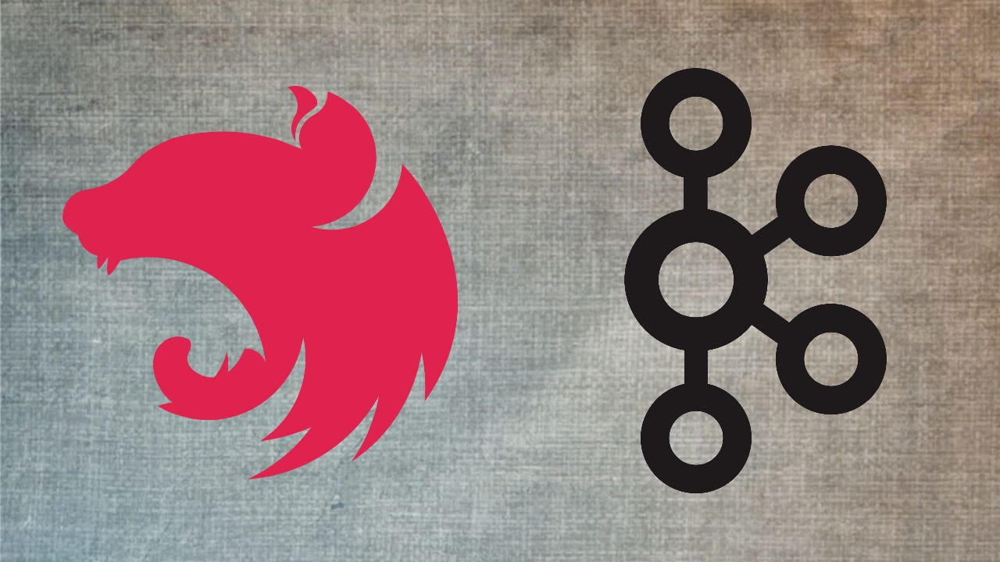
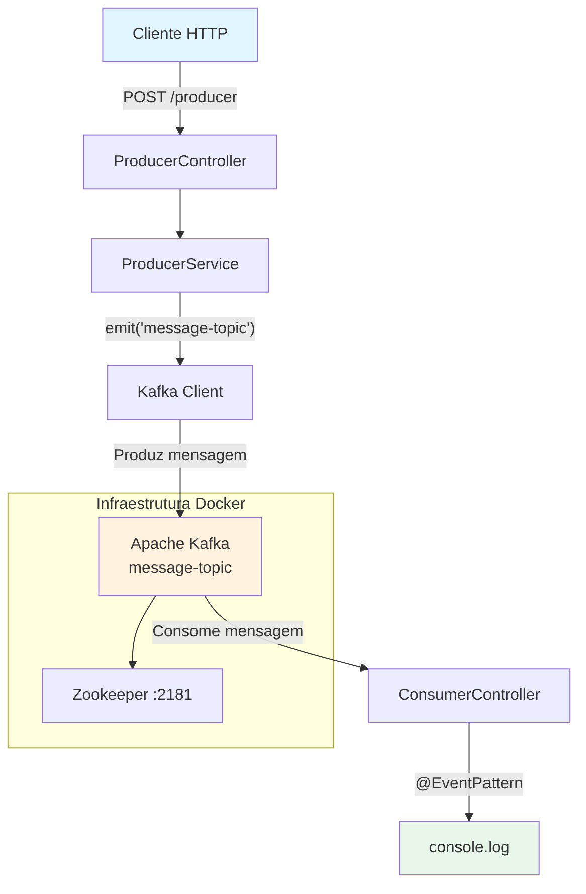
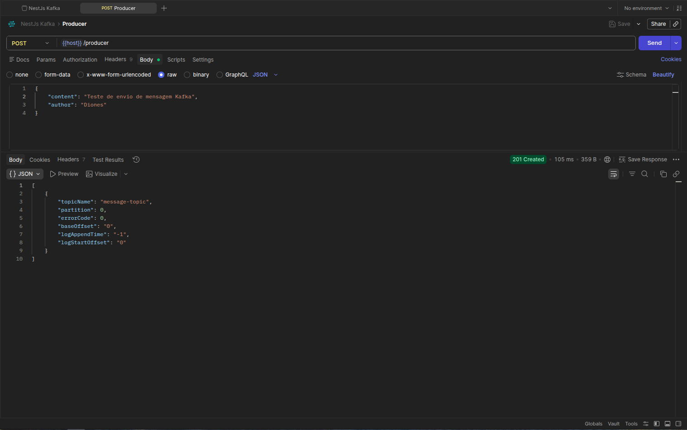
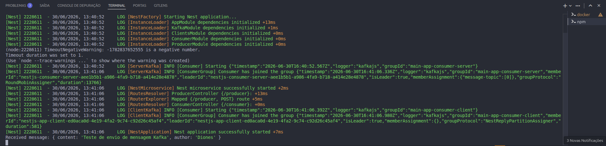

<p align="center">
  
</p>

<h1 align="center">NestJS com Kafka</h1>

<p align="center">
  Aplicação <strong>NestJS</strong> integrada ao <strong>Apache Kafka</strong> para comunicação assíncrona via mensageria.
</p>

<p align="center">
  <a href="#-visão-geral">Visão Geral</a>&nbsp;&nbsp;|&nbsp;
  <a href="#-arquitetura">Arquitetura</a>&nbsp;&nbsp;|&nbsp;
  <a href="#-pré-requisitos">Pré-requisitos</a>&nbsp;&nbsp;|&nbsp;
  <a href="#-instalação">Instalação</a>&nbsp;&nbsp;|&nbsp;
  <a href="#-execução">Execução</a>&nbsp;&nbsp;|&nbsp;
  <a href="#-api">API</a>&nbsp;&nbsp;|&nbsp;
  <a href="#-testes">Testes</a>&nbsp;&nbsp;|&nbsp;
  <a href="#-screenshots">Screenshots</a>
</p>

---

## 📋 Visão Geral

Este projeto demonstra a integração do [NestJS](https://nestjs.com/) com o [Apache Kafka](https://kafka.apache.org/) utilizando o padrão de **mensageria assíncrona**. A aplicação expõe uma **API REST** que produz mensagens para um tópico Kafka, enquanto um **consumidor** escuta e processa essas mensagens em tempo real.

### Fluxo de Dados

```
Cliente HTTP → POST /producer → NestJS Producer → Kafka Topic → NestJS Consumer → Console/Terminal
```

---

## 🏗️ Arquitetura

### Estrutura de Diretórios

```
.
├── docker-compose.yml          # Infraestrutura Kafka + Zookeeper
├── src/
│   ├── main.ts                 # Ponto de entrada + configuração Kafka
│   ├── app.module.ts           # Módulo raiz da aplicação
│   ├── kafka/
│   │   └── kafka.module.ts     # Módulo compartilhado do cliente Kafka
│   ├── producer/
│   │   ├── producer.controller.ts   # POST /producer
│   │   ├── producer.service.ts      # Lógica de envio ao Kafka
│   │   ├── producer.module.ts       # Módulo do produtor
│   │   └── dto/
│   │       └── create-message.dto.ts # Validação da payload
│   └── consumer/
│       ├── consumer.controller.ts   # Event listener do Kafka
│       └── consumer.module.ts       # Módulo do consumidor
├── test/
│   ├── app.e2e-spec.ts         # Teste end-to-end
│   └── jest-e2e.json           # Configuração do Jest E2E
└── .env                        # Variáveis de ambiente
```

### Diagrama da Arquitetura



### Componentes

| Componente | Tecnologia | Responsabilidade |
|---|---|---|
| **API REST** | NestJS + Express | Endpoint `POST /producer` com validação |
| **Cliente Kafka** | `@nestjs/microservices` + KafkaJS | Conexão e comunicação com o broker |
| **Producer** | KafkaJS Producer | Publica mensagens no tópico `message-topic` |
| **Consumer** | KafkaJS Consumer | Escuta o tópico e processa eventos |
| **Broker** | Confluent Kafka 7.4.0 | Mensageria distribuída |
| **Zookeeper** | Confluent Zookeeper 7.4.0 | Coordenação do cluster Kafka |

### Configurações Técnicas

- **Broker**: `127.0.0.1:9092`
- **Consumer Group ID**: `main-app-consumer`
- **Tópico**: `message-topic`
- **Timeout de conexão**: 10 segundos
- **Partitioner**: `LegacyPartitioner` (KafkaJS)
- **Validação**: Global `ValidationPipe` com `whitelist` e `forbidNonWhitelisted`
- **Porta HTTP**: `4000` (configurável via `PORT` no `.env`)

---

## ✅ Pré-requisitos

- **Node.js** >= 22
- **npm** >= 10
- **Docker** e **Docker Compose** (para subir o Kafka)

---

## 🔧 Instalação

### 1. Clone o repositório

```bash
git clone https://github.com/seu-usuario/nestjs-kafka.git
cd nestjs-kafka
```

### 2. Instale as dependências

```bash
npm install
```

### 3. Configure as variáveis de ambiente

```bash
# .env (já existente no projeto)
PORT=4000
```

### 4. Inicie o Kafka e Zookeeper

```bash
docker-compose up -d
```

> Aguarde alguns segundos até que o Kafka esteja pronto para aceitar conexões.

---

## 🚀 Execução

### Desenvolvimento

```bash
npm run dev
```

A aplicação será iniciada em **http://localhost:4000**.

### Produção

```bash
npm run build
npm run start:prod
```

---

## 📡 API

### `POST /producer`

Envia uma mensagem para o tópico `message-topic` do Kafka.

#### Request Body

| Campo | Tipo | Obrigatório | Descrição |
|---|---|---|---|
| `content` | `string` | Sim | Conteúdo da mensagem |
| `author` | `string` | Sim | Nome do autor |

#### Exemplo

```bash
curl -X POST http://localhost:4000/producer \
  -H "Content-Type: application/json" \
  -d '{
    "content": "Olá, Kafka!",
    "author": "NestJS"
  }'
```

#### Respostas

| Status | Descrição |
|---|---|
| `201` | Mensagem enviada ao Kafka com sucesso |
| `400` | Erro de validação (campos ausentes ou inválidos) |

### Consumer

O consumidor escuta o tópico `message-topic` e exibe as mensagens recebidas no console do servidor:

```bash
[Nest] 12345  - 01/01/2025 12:00:00  Received message: { content: 'Olá, Kafka!', author: 'NestJS' }
```

---

## 🧪 Testes

### Testes unitários

```bash
npm test
```

### Testes end-to-end

```bash
npm run test:e2e
```

### Cobertura

```bash
npm run test:cov
```

---

## 📸 Screenshots

> Adicione aqui as imagens das principais telas da aplicação.

### Exemplo de requisição via Insomnia / Postman

<p align="center">
  
</p>

*Requisição `POST /producer` sendo testada no Insomnia.*

### Log do Consumer no terminal

<p align="center">
  
</p>

*Mensagem recebida e exibida pelo Consumer no console.*

---

## 🛠️ Stack Tecnológica

| Categoria | Tecnologias |
|---|---|
| **Runtime** | Node.js, TypeScript |
| **Framework** | NestJS 11, Express |
| **Mensageria** | Apache Kafka, KafkaJS, @nestjs/microservices |
| **Validação** | class-validator, class-transformer |
| **Infraestrutura** | Docker, Docker Compose, Confluent Kafka |
| **Testes** | Jest, Supertest |
| **Linter/Formatter** | ESLint, Prettier |

---

## 📄 Licença

Este projeto está sob a licença **UNLICENSED**.
